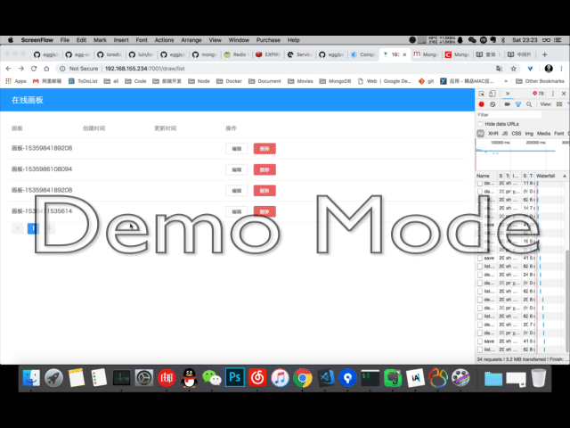

# 项目介绍

在线画板

# quick start

## 安装依赖

```shell
  npm i
```

## 本地开发启动应用

```shell
  npm run dev
```

应用访问: http://127.0.0.1:7001

## 发布模式启动应用

1. 构建
```shell
npm run build
```

2. 启动应用

```shell
npm run start
```

## 技术架构

构建方案基于```easywebpack```的```Egg+Vue```单页应用解决方案

前端框架：```Vue``` + ```Element UI```

后端框架：```Egg.js``` + ```MongoDB``` + ```Redis```

## 基本效果预览

### 画板操作GIF


