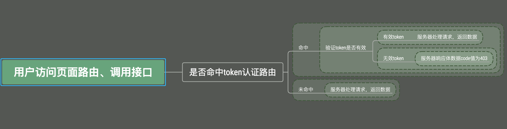

# 项目设计文档

## Redis 数据结构设计

### 登录态Redis设计

```shell
  setex ${userName} ${expire} ${token} // userToken DB: 用户ID关联token，过期时间默认是30min
  setex ${token} ${expire} ${userName} // token DB: 用户token关联用户ID，过期时间默认是30min
  hset ${userId} name ${userName} ... // userInfo DB: 用户ID关联用户信息
```

这里冗余设计了一下:

- ````userToken DB```这个库是用来存储用户名跟```token```的关联
- ```token DB```这个库是用来存储```token```跟用户名的关联

这样子设计是因为不想单纯只靠一个```token DB```库来保存登录态，用户重复登录的话，这个库会在一段时间增量存在无效数据，占用内存；
所以在设计了一个```userToken DB```库，用户重新登录，会根据用户名从这个表查找是否有存在```token```，有的话，清除这个数据和
```token DB```的数据。


### 单页应用的用户认证原理

这里使用了```history```模式来接管前端路由，所以需要使用后端需要启用一个通配路由```*```，所有匹配不到的路由都将返回首页，统一由前端进行处理，要注意的是，这个通配路由一定要写在所有路由之后，否则所有的路由都会命中通配路由，直接返回首页；

前后端路由配置好后，接下来进行```token```认证的步骤，先看下大体流程图：


当前请求路由是否命中```token```认证路由，由中间件```authToken```进行处理，其判断依据由```ctx.helper.isIgnorePath```函数返回值决定：

- 返回值为```true```代表不命中，继续进行下一步；
- 返回值为```false```代表命中，此时再根据```token```去```redis```的```token```库查询此```token```:

  - 有值，则表示此```token```有效，可以继续处理请求；
  - 没有值，则表示此```token```无效，设置响应体中```code```值为```403```并返回，前端收到```403```后，直接跳转到登录页。
